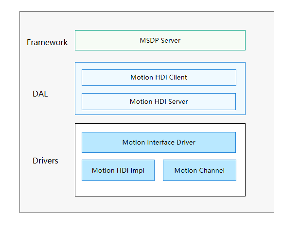

# Motion

## 简介

基于HDF（Hardware Driver Foundation）驱动框架开发的Motion驱动，能够屏蔽硬件器件差异，为上层服务提供稳定的手势识别基础能力接口，包括Motion使能/去使能、Motion订阅/取消订阅等稳定的接口。

Motion驱动模块如图1所示，上层为Framework层，提供MSDP服务，通过UHDF（User Hardware Driver Foundation）层的Motion Proxy与Motion Stub进行交互；而Motion Stub可调用Motion HDI实现类接口，从而实现上层服务的手势识别使能/去使能、手势识别订阅/取消订阅等能力。

**图 1** Motion驱动模块架构图



## 目录

Motion驱动源代码目录结构如下所示：

```
/drivers/peripheral/motion
├── hdi_service                          # motion模块对上层服务提供的驱动能力
├── test                                 # motion模块测试代码
│   └── unittest\hdi                     # motion模块hdi单元测试代码
```

## 说明

### 接口说明

Motion驱动模块为上层服务提供可直接调用的能力接口，涉及的主要功能有：使能/去使能手势识别、订阅/取消订阅手势识别数据等操作。Motion驱动模型对HDI开放的API接口功能如表1：

**表 1**  Motion HDI 接口列表

| 接口名                                                       | 功能描述                                                     |
| ------------------------------------------------------------ | ------------------------------------------------------------ |
| int32_t EnableMotion(int32_t motionType)                     | 使能一种手势识别类型，只有数据订阅者使能手势识别后，才能获取订阅的手势识别数据。 |
| int32_t DisableMotion(int32_t motionType)                    | 去使能一种手势识别类型。                                     |
| int32_t Register(const sptr\<IMotionCallback\> &callbackObj)   | 订阅者成功注册手势识别数据回调函数，系统会将获取到的手势识别数据上报给订阅者。 |
| int32_t Unregister(const sptr\<IMotionCallback\> &callbackObj) | 订阅者取消注册手势识别数据回调函数。                           |

### 使用说明

本节以订阅拿起手势识别数据为例进行介绍。

代码示例

```
#include "v1_0/imotion_interface.h"

/* 手势识别回调服务类 */
class MotionCallbackService : public IMotionCallback {
public:
    MotionCallbackService() = default;
    virtual ~MotionCallbackService() = default;
    int32_t OnDataEvent(const HdfMotionEvent &event) override;
};

/* 回调函数 */
int32_t MotionCallbackService::OnDataEvent(const HdfMotionEvent &event)
{
    printf("moton :[%d], result[%d]:, status[%d]\n\r", event.motion, event.result, event.status);
    return HDF_SUCCESS;
}

void MotionSample(void)
{
    int32_t ret;
    sptr<IMotionInterface> g_motionInterface = nullptr;
    sptr<IMotionCallback> g_motionCallback = new MotionCallbackService();
    sptr<IMotionCallback> g_motionCallbackUnregistered = new MotionCallbackService();

    /* 1.获取motion服务 */
    g_motionInterface = IMotionInterface::Get();
    if (g_motionInterface == nullptr) {
        return;
    }
    /* 2.订阅者注册手势识别数据回调处理函数 */
    ret = g_motionInterface->Register(g_motionCallback);
    if (ret != 0) {
        return;
    }
    /* 3.使能手势识别 */
    ret = g_motionInterface->EnableMotion(HDF_MOTION_TYPE_PICKUP);
    if (ret != 0) {
        return;
    }
    /* 4.去使能手势识别 */
    ret = g_motionInterface->DisableMotion(HDF_MOTION_TYPE_PICKUP);
    if (ret != 0) {
        return;
    }
    /* 5.取消手势识别数据订阅函数 */
    ret = g_motionInterface->Unregister(g_motionCallback);
    if (ret != 0) {
        return;
    }
}
```

## 相关仓

[驱动子系统](https://gitee.com/openharmony/docs/blob/master/zh-cn/readme/%E9%A9%B1%E5%8A%A8%E5%AD%90%E7%B3%BB%E7%BB%9F.md)

[drivers_hdf_core](https://gitee.com/openharmony/drivers_hdf_core)

[drivers_interface](https://gitee.com/openharmony/drivers_interface)

[**drivers\_peripheral**](https://gitee.com/openharmony/drivers_peripheral)