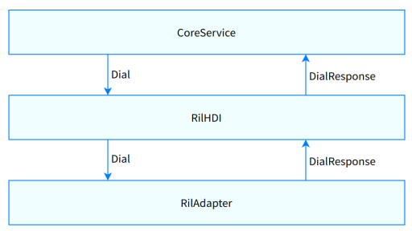

# Ril

## Overview

The Ril driver developed based on the Hardware Driver Foundation (HDF) driver framework shields hardware differences and provides APIs for upper-layer services, such as making calls, sending SMS messages, and activating SIM cards.

The Ril driver module contains definitions and implementation code of Ril hardware driver interfaces (HDIs) and provides the telephony driver capability APIs for the upper layer. The HDIs implement service processing related to the following services:

-   Call 
-   SIM card
-   SMS/MMS
-   Radio
-   Cellular data

**Figure 1** Architecture of the Ril driver module



## Directory Structure

The source code directory structure is as follows:

```
/drivers/peripheral/ril
├── figures                # Readme resource files
├── interfaces             # Driver capability APIs provided for upper-layer services
│   └── include            # APIs exposed externally
```

## **Constraints**

-   Programming language: C++
-   Software constraints: This module must work with the Ril Adapter module (ril\_adapter).
-   Hardware constraints: The device must be equipped with a modem capable of independent cellular communication.

## Usage Description

### Available APIs

The Ril driver provides capability APIs that can be directly called by the framework layer. The main functions are as follows: call, SIM card, SMS/MMS, cellular data, and event reporting. The following table lists the APIs provided by the Ril driver module.

**Table 1** Ril HDI APIs

| API                                                      | Description                                                    |
| ------------------------------------------------------------ | ------------------------------------------------------------ |
| int32_t SetCallback(const sptr\<IRilCallback\> &rilCallback) | Sets the IRil callback.|
| int32_t Dial(int32_t slotId, int32_t serialId, const DialInfo &dialInfo) | Makes a call. **slotId** indicates the card slot ID, **serialId** indicates the serial ID of the request, and **dialInfo** indicates the dialing information.|
| int32_t Answer(int32_t slotId, int32_t serialId) | Answers a call. **slotId** indicates the card slot ID, and **serialId** indicates the serial ID of the request.|
| int32_t SendGsmSms(int32_t slotId, int32_t serialId, const GsmSmsMessageInfo &gsmSmsMessageInfo) | Sends a GSM SMS message. **slotId** indicates the card slot ID, **serialId** indicates the serial ID of the request, and **gsmSmsMessageInfo** indicates the GSM SMS message information.|
| int32_t SetActiveSim(int32_t slotId, int32_t serialId, int32_t index, int32_t enable) |  Activates or deactivates a SIM card. **slotId** indicates the card slot ID, **serialId** indicates the serial ID of the request, **index** indicates the index value of the SIM card information, and **enable** indicates the activation status.|
| int32_t GetOperatorInfo(int32_t slotId, int32_t serialId) | Queries the carrier name. **slotId** indicates the card slot ID, and **serialId** indicates the serial ID of the request.|
| int32_t ActivatePdpContext(int32_t slotId, int32_t serialId, const DataCallInfo &dataCallInfo) | Activates the PDP context. **slotId** indicates the card slot ID, and **dataCallInfo** indicates the data service information.|
| int32_t SetRadioState(int32_t slotId, int32_t serialId, int32_t fun, int32_t rst) | Sets the radio state. **slotId** indicates the card slot ID, **serialId** indicates the serial ID of the request, **fun** indicates the function mode, and **rst** indicates whether to perform a reset.|

For details about the APIs, access [drivers_interface_ril](https://gitee.com/openharmony/drivers_interface/blob/master/ril/v1_1/IRil.idl).

### How to Use

This section uses the call service implementation as an example.

Sample code:

```c++
#include "V1_1/iril.h"

/* Ril callback class */
class RilCallback : public HDI::Ril::V1_1::IRilCallback {
    int32_t DialResponse(const HDI::Ril::V1_1::RilRadioResponseInfo &responseInfo) override;
    int32_t HangupResponse(const HDI::Ril::V1_1::RilRadioResponseInfo &responseInfo) override;
    int32_t RejectResponse(const HDI::Ril::V1_1::RilRadioResponseInfo &responseInfo) override;
    int32_t AnswerResponse(const HDI::Ril::V1_1::RilRadioResponseInfo &responseInfo) override;
    ...
}

/* Callback */
int32_t RilCallback::DialResponse(const HDI::Ril::V1_1::RilRadioResponseInfo &responseInfo)
{
    printf("DialResponse");
    return 0;
}

void RilSample(void)
{
    /* Create a Ril interface instance. */
    sptr<OHOS::HDI::Ril::V1_1::IRil> g_rilInterface = OHOS::HDI::Ril::V1_1::IRil::Get();
    if (g_rilInterface == nullptr) {
        return;
    }
    /* Set a callback. */
    sptr<HDI::Ril::V1_1::IRilCallback> g_cbObj = new RilCallback();
    g_rilInterface->SetCallback(RilCallback());

    /** Make a call. **/
    int32_t slotId = 0;
    int32_t serialId = 1;
    HDI::Ril::V1_1::DialInfo dialInfo = {};
    dialInfo.address = "10086";
    dialInfo.clir = 0;
    int32_t ret = g_rilInterface->Dial(slotId, serialId, dialInfo);
}
```

## Repositories Involved

[Driver](https://gitee.com/openharmony/docs/blob/master/en/readme/driver.md)

[drivers\_framework](https://gitee.com/openharmony/drivers_framework/blob/master/README.md)

[drivers\_adapter](https://gitee.com/openharmony/drivers_adapter/blob/master/README.md)

[drivers\_adapter\_khdf\_linux](https://gitee.com/openharmony/drivers_adapter_khdf_linux/blob/master/README.md)

[drivers\_peripheral](https://gitee.com/openharmony/drivers_peripheral)

[telephony_core_service](https://gitee.com/openharmony/telephony_core_service/blob/master/README.md)

[telephony\_ril\_adapter](https://gitee.com/openharmony/telephony_ril_adapter/blob/master/README.md)
