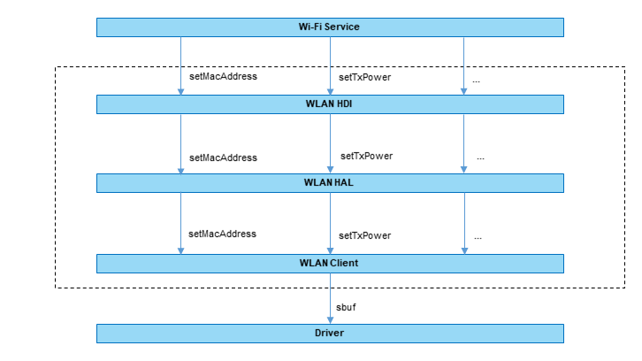

# WLAN<a name="ZH-CN_TOPIC_0000001078436908"></a>

## 简介<a name="section11660541593"></a>

该仓下主要包含WLAN相关HDI和HAL接口与实现，提供主要功能包括：

1.  创建和销毁IWiFi对象。
2.  创建和销毁HAL层和WLAN驱动的通道。
3.  设置MAC地址、设置国家码、获取网络设备信息等。

**图 1**  WLAN驱动模块架构图<a name="fig14142101381112"></a>



## 目录<a name="section161941989596"></a>

WLAN源代码目录结构如下所示：

```
/drivers/peripheral/wlan
├── client              # 实现用户态与内核态通信的client模块存放目录
│   └── include         # client相关头文件存放目录
│   └── src             # client代码存放目录
├── hal                 # hal层框架代码
│   └── include         # hal层相关头文件存放目录
│   └── src             # hal层代码存放目录
├── hdi_service         # hdi层框架代码
│   └── service_common  # hdi层通用接口存放目录
│   └── service_extend  # hdi扩展接口存放目录
├── interfaces          # hal接口的存放目录
│   └── include         # 对外提供的接口头文件存放目录
```

### 接口说明<a name="section1564411661810"></a>

WLAN驱动模块通过HAL/HDI层(HAL是直调，HDI是通过IPC调用)对Wi-Fi Service提供接口，主要功能有：创建/销毁IWiFi对象、设置MAC地址等。提供的接口说明如下表所示：

**表 1**  hal层和hdi层对外接口

<a name="table1521573319472"></a>
<table><thead align="left"><tr id="row121519334474"><th class="cellrowborder" valign="top" w idth="10.950000000000001%" id="mcps1.2.4.1.1"><p id="p1221510339475"><a name="p1221510339475"></a><a name="p1221510339475"></a>头文件</p>
</th>
<th class="cellrowborder" valign="top" width="30.91%" id="mcps1.2.4.1.2"><p id="p0215153344716"><a name="p0215153344716"></a><a name="p0215153344716"></a>HDI接口名称</p>
</th>
<th class="cellrowborder" valign="top" width="6.950000000000001%" id="mcps1.2.4.1.1"><p id="p1221510339475"><a name="p1221510339475"></a><a name="p1221510339475"></a>头文件</p>
</th>
<th class="cellrowborder" valign="top" width="30.91%" id="mcps1.2.4.1.2"><p id="p0215153344716"><a name="p0215153344716"></a><a name="p0215153344716"></a>HAL接口名称</p>
</th>
<th class="cellrowborder" valign="top" width="20.14%" id="mcps1.2.4.1.3"><p id="p1421503315478"><a name="p1421503315478"></a><a name="p1421503315478"></a>功能描述</p>
</th>
</tr>
</thead>
<tbody><tr id="row112150333476">
<td class="cellrowborder" rowspan="31" valign="top" width="10.950000000000001%" headers="mcps1.2.4.1.1 "><p id="p2155710125317"><a name="p2155710125317"></a><a name="p2155710125317"></a>v1_0/iwlan_interface.h(V1_0为版本号，随着接口的增加而改变)</p>
<p id="p189132019183"><a name="p189132019183"></a><a name="p189132019183"></a></p>
</td>
<td class="cellrowborder" valign="top" headers="mcps1.2.4.1.1 "><p id="p4950434142314"><a name="p4950434142314"></a><a name="p4950434142314"></a>int32_t (*Start)(struct IWlanInterface *self);</p>
</td>
<td class="cellrowborder" rowspan="15" valign="top" width="6.950000000000001%" headers="mcps1.2.4.1.1 "><p id="p2155710125317"><a name="p2155710125317"></a><a name="p2155710125317"></a>wifi_hal.h</p>
<p id="p189132019183"><a name="p189132019183"></a><a name="p189132019183"></a></p>
</td>
<td class="cellrowborder" valign="top" headers="mcps1.2.4.1.1 "><p id="p4950434142314"><a name="p4950434142314"></a><a name="p4950434142314"></a>int32_t (*start)(struct IWiFi *);</p>
</td>
<td class="cellrowborder" valign="top" headers="mcps1.2.4.1.2 "><p id="p1162543816393"><a name="p1162543816393"></a><a name="p1162543816393"></a>创建HAL和驱动之间的通道及获取驱动支持的网卡信息。</p>
</td>
</tr>
<tr id="row167876105514"><td class="cellrowborder" valign="top" headers="mcps1.2.4.1.1 "><p id="p162433816392"><a name="p162433816392"></a><a name="p162433816392"></a>int32_t (*Stop)(struct IWlanInterface *self);</p>
</td>
<td class="cellrowborder" valign="top" headers="mcps1.2.4.1.1 "><p id="p162433816392"><a name="p162433816392"></a><a name="p162433816392"></a>int32_t (*stop)(struct IWiFi *);</p>
</td>
<td class="cellrowborder" valign="top" headers="mcps1.2.4.1.2 "><p id="p186235383393"><a name="p186235383393"></a><a name="p186235383393"></a>销毁通道。</p>
</td>
</tr>
<tr id="row77607815516"><td class="cellrowborder" valign="top" headers="mcps1.2.4.1.1 "><p id="p6760128135514"><a name="p6760128135514"></a><a name="p6760128135514"></a>int32_t (*GetSupportFeature)(struct IWlanInterface *self, uint8_t* supType, uint32_t* supTypeLen);</p>
</td>
<td class="cellrowborder" valign="top" headers="mcps1.2.4.1.1 "><p id="p6760128135514"><a name="p6760128135514"></a><a name="p6760128135514"></a>int32_t (*getSupportFeature)(uint8_t *supType, uint32_t size);</p>
</td>
<td class="cellrowborder" valign="top" headers="mcps1.2.4.1.2 "><p id="p1176014845516"><a name="p1176014845516"></a><a name="p1176014845516"></a>获取该设备支持的WLAN特性（不考虑当前的使用状态）。</p>
</td>
</tr>
<tr id="row93918373572"><td class="cellrowborder" valign="top" headers="mcps1.2.4.1.1 "><p id="p2039103714572"><a name="p2039103714572"></a><a name="p2039103714572"></a>int32_t (*GetSupportCombo)(struct IWlanInterface *self, uint64_t* combo);</p>
</td>
<td class="cellrowborder" valign="top" headers="mcps1.2.4.1.1 "><p id="p2039103714572"><a name="p2039103714572"></a><a name="p2039103714572"></a>int32_t (*getSupportCombo)(uint64_t *combo, uint32_t size);</p>
</td>
<td class="cellrowborder" valign="top" headers="mcps1.2.4.1.2 "><p id="p13916375570"><a name="p13916375570"></a><a name="p13916375570"></a>获取多网卡共存情况。</p>
</td>
</tr>
<tr id="row25031321195815"><td class="cellrowborder" valign="top" headers="mcps1.2.4.1.1 "><p id="p13503142195814"><a name="p13503142195814"></a><a name="p13503142195814"></a>int32_t (*CreateFeature)(struct IWlanInterface *self, int32_t type, struct HdfFeatureInfo* ifeature);</p>
</td>
<td class="cellrowborder" valign="top" headers="mcps1.2.4.1.1 "><p id="p13503142195814"><a name="p13503142195814"></a><a name="p13503142195814"></a>int32_t (*createFeature)(int32_t type, struct IWiFiBaseFeature **ifeature);</p>
</td>
<td class="cellrowborder" valign="top" headers="mcps1.2.4.1.2 "><p id="p11503172115585"><a name="p11503172115585"></a><a name="p11503172115585"></a>根据输入类型创建对应的特性。</p>
</td>
</tr>
<tr id="row14371833185819"><td class="cellrowborder" valign="top" headers="mcps1.2.4.1.1 "><p id="p1443863325820"><a name="p1443863325820"></a><a name="p1443863325820"></a>int32_t (*GetFeatureByIfName)(struct IWlanInterface *self, const char* ifName, struct HdfFeatureInfo* ifeature);</p>
</td>
<td class="cellrowborder" valign="top" headers="mcps1.2.4.1.1 "><p id="p1443863325820"><a name="p1443863325820"></a><a name="p1443863325820"></a>int32_t (*getFeatureByIfName)(const char *ifName, struct IWiFiBaseFeature **ifeature);</p>
</td>
<td class="cellrowborder" valign="top" headers="mcps1.2.4.1.2 "><p id="p1343819334584"><a name="p1343819334584"></a><a name="p1343819334584"></a>通过网络接口名字获取对应的特性。</p>
</td>
</tr>
<tr id="row03398561587"><td class="cellrowborder" valign="top" headers="mcps1.2.4.1.1 "><p id="p1933965615812"><a name="p1933965615812"></a><a name="p1933965615812"></a>int32_t (*RegisterEventCallback)(struct IWlanInterface *self, struct IWlanCallback* cbFunc, const char* ifName);</p>
</td>
<td class="cellrowborder" valign="top" headers="mcps1.2.4.1.1 "><p id="p1933965615812"><a name="p1933965615812"></a><a name="p1933965615812"></a>int32_t (*registerEventCallback)(CallbackFunc cbFunc);</p>
</td>
<td class="cellrowborder" valign="top" headers="mcps1.2.4.1.2 "><p id="p103396560587"><a name="p103396560587"></a><a name="p103396560587"></a>注册IWiFi的回调函数，监听异步事件。</p>
</td>
</tr>
<tr id="row894162955918"><td class="cellrowborder" valign="top" headers="mcps1.2.4.1.1 "><p id="p1694112914590"><a name="p1694112914590"></a><a name="p1694112914590"></a>int32_t (*UnregisterEventCallback)(struct IWlanInterface *self, struct IWlanCallback* cbFunc, const char* ifName);</p>
</td>
<td class="cellrowborder" valign="top" headers="mcps1.2.4.1.1 "><p id="p1694112914590"><a name="p1694112914590"></a><a name="p1694112914590"></a>int32_t (*unRegisterEventCallback)(void);</p>
</td>
<td class="cellrowborder" valign="top" headers="mcps1.2.4.1.2 "><p id="p18948295597"><a name="p18948295597"></a><a name="p18948295597"></a>去注册IWiFi的回调函数。</p>
</td>
</tr>
<tr id="row122731451103"><td class="cellrowborder" valign="top" headers="mcps1.2.4.1.1 "><p id="p2273125104"><a name="p2273125104"></a><a name="p2273125104"></a>int32_t (*DestroyFeature)(struct IWlanInterface *self, const struct HdfFeatureInfo* ifeature);</p>
</td>
<td class="cellrowborder" valign="top" headers="mcps1.2.4.1.1 "><p id="p2273125104"><a name="p2273125104"></a><a name="p2273125104"></a>int32_t (*destroyFeature)(struct IWiFiBaseFeature *ifeature);</p>
</td>
<td class="cellrowborder" valign="top" headers="mcps1.2.4.1.2 "><p id="p92731553017"><a name="p92731553017"></a><a name="p92731553017"></a>销毁对应的特性。</p>
</td>
</tr>
<tr id="row172153335473"><td class="cellrowborder" valign="top" headers="mcps1.2.4.1.1 "><p id="p1292417115515"><a name="p1292417115515"></a><a name="p1292417115515"></a>int32_t (*ResetDriver)(struct IWlanInterface *self, uint8_t chipId, const char* ifName);</p>
</td>
<td class="cellrowborder" valign="top" headers="mcps1.2.4.1.1 "><p id="p1292417115515"><a name="p1292417115515"></a><a name="p1292417115515"></a>int32_t (*resetDriver)(const uint8_t chipId);</p>
</td>
<td class="cellrowborder" valign="top" headers="mcps1.2.4.1.2 "><p id="p17272317145516"><a name="p17272317145516"></a><a name="p17272317145516"></a>WLAN驱动进行重置。</p>
</td>
</tr>
<tr id="row172153335473"><td class="cellrowborder" valign="top" headers="mcps1.2.4.1.1 "><p id="p1292417115515"><a name="p1292417115515"></a><a name="p1292417115515"></a>int32_t (*GetPowerMode)(struct IWlanInterface *self, const struct HdfFeatureInfo* ifeature, uint8_t* mode);</p>
</td>
<td class="cellrowborder" valign="top" headers="mcps1.2.4.1.1 "><p id="p1292417115515"><a name="p1292417115515"></a><a name="p1292417115515"></a>int32_t (*getPowerMode)(const char *ifName, uint8_t *mode);</p>
</td>
<td class="cellrowborder" valign="top" headers="mcps1.2.4.1.2 "><p id="p17272317145516"><a name="p17272317145516"></a><a name="p17272317145516"></a>获取正在使用的功率模式。</p>
</td>
</tr>
<tr id="row172153335473"><td class="cellrowborder" valign="top" headers="mcps1.2.4.1.1 "><p id="p1292417115515"><a name="p1292417115515"></a><a name="p1292417115515"></a>int32_t (*SetPowerMode)(struct IWlanInterface *self, const struct HdfFeatureInfo* ifeature, uint8_t mode);</p>
</td>
<td class="cellrowborder" valign="top" headers="mcps1.2.4.1.1 "><p id="p1292417115515"><a name="p1292417115515"></a><a name="p1292417115515"></a>int32_t (*setPowerMode)(const char *ifName, uint8_t mode);</p>
</td>
<td class="cellrowborder" valign="top" headers="mcps1.2.4.1.2 "><p id="p17272317145516"><a name="p17272317145516"></a><a name="p17272317145516"></a>设置功率模式。</p>
</td>
</tr>
<tr id="row172153335473"><td class="cellrowborder" valign="top" headers="mcps1.2.4.1.1 "><p id="p1292417115515"><a name="p1292417115515"></a><a name="p1292417115515"></a>int32_t (*StartChannelMeas)(struct IWlanInterface *self, const char* ifName, const struct MeasChannelParam* measChannelParam);</p>
</td>
<td class="cellrowborder" valign="top" headers="mcps1.2.4.1.1 "><p id="p1292417115515"><a name="p1292417115515"></a><a name="p1292417115515"></a>int32_t (*startChannelMeas)(const char *ifName, const struct MeasParam *measParam);</p>
</td>
<td class="cellrowborder" valign="top" headers="mcps1.2.4.1.2 "><p id="p17272317145516"><a name="p17272317145516"></a><a name="p17272317145516"></a>通过ioctl向底层驱动发送信道测量命令。</p>
</td>
</tr>
<tr id="row172153335473"><td class="cellrowborder" valign="top" headers="mcps1.2.4.1.1 "><p id="p1292417115515"><a name="p1292417115515"></a><a name="p1292417115515"></a>int32_t (*GetNetDevInfo)(struct IWlanInterface *self, struct HdfNetDeviceInfoResult* netDeviceInfoResult);</p>
</td>
<td class="cellrowborder" valign="top" headers="mcps1.2.4.1.1 "><p id="p1292417115515"><a name="p1292417115515"></a><a name="p1292417115515"></a>int32_t (*getNetDevInfo)(struct NetDeviceInfoResult *netDeviceInfoResult);</p>
</td>
<td class="cellrowborder" valign="top" headers="mcps1.2.4.1.2 "><p id="p17272317145516"><a name="p17272317145516"></a><a name="p17272317145516"></a>获取网络设备信息（设备索引、网卡名字、MAC等信息）。</p>
</td>
</tr>
<tr id="row172153335473"><td class="cellrowborder" valign="top" headers="mcps1.2.4.1.1 "><p id="p1292417115515"><a name="p1292417115515"></a><a name="p1292417115515"></a>int32_t (*GetChannelMeasResult)(struct IWlanInterface *self, const char* ifName, struct MeasChannelResult* measChannelResult);</p>
</td>
<td class="cellrowborder" valign="top" headers="mcps1.2.4.1.1 "><p id="p1292417115515"><a name="p1292417115515"></a><a name="p1292417115515"></a>int32_t (*getChannelMeasResult)(const char *ifName, struct MeasResult *measResult);</p>
</td>
<td class="cellrowborder" valign="top" headers="mcps1.2.4.1.2 "><p id="p17272317145516"><a name="p17272317145516"></a><a name="p17272317145516"></a>获取底层上报上来的测量结果。</p>
</td>
</tr>
<tr id="row27321001058"><td class="cellrowborder" valign="top" width="30.91%" headers="mcps1.2.4.1.2 "><p id="p77321105516"><a name="p77321105516"></a><a name="p77321105516"></a>int32_t (*GetAssociatedStas)(struct IWlanInterface *self, const struct HdfFeatureInfo* ifeature,struct HdfStaInfo* staInfo, uint32_t* staInfoLen, uint32_t* num);</p>
</td>
<td class="cellrowborder" rowspan="2" valign="top" width="6.950000000000001%" headers="mcps1.2.4.1.1 "><p id="p134208191041"><a name="p134208191041"></a><a name="p134208191041"></a>wifi_hal_ap_feature.h</p>
</td>
<td class="cellrowborder" valign="top" width="30.91%" headers="mcps1.2.4.1.2 "><p id="p77321105516"><a name="p77321105516"></a><a name="p77321105516"></a>int32_t (*getAssociatedStas)(const struct IWiFiAp *apFeature, struct StaInfo *staInfo, uint32_t count, uint32_t *num);</p>
</td>
<td class="cellrowborder" valign="top" width="20.14%" headers="mcps1.2.4.1.3 "><p id="p1673213014513"><a name="p1673213014513"></a><a name="p1673213014513"></a>获取连接上的所有STA的信息（目前只包含MAC地址）。</p>
</td>
</tr>
<tr id="row39802291664"><td class="cellrowborder" valign="top" headers="mcps1.2.4.1.1 "><p id="p149801729465"><a name="p149801729465"></a><a name="p149801729465"></a>int32_t (*SetCountryCode)(struct IWlanInterface *self, const struct HdfFeatureInfo* ifeature, const char* code, uint32_t len);</p>
</td>
<td class="cellrowborder" valign="top" headers="mcps1.2.4.1.1 "><p id="p149801729465"><a name="p149801729465"></a><a name="p149801729465"></a>int32_t (*setCountryCode)(const struct IWiFiAp *apFeature, const char *code, uint32_t len);</p>
</td>
<td class="cellrowborder" valign="top" headers="mcps1.2.4.1.2 "><p id="p098022910610"><a name="p098022910610"></a><a name="p098022910610"></a>设置国家码。</p>
</td>
</tr>
<tr id="row14149145512411"><td class="cellrowborder" valign="top" width="30.91%" headers="mcps1.2.4.1.2 "><p id="p17149165511414"><a name="p17149165511414"></a><a name="p17149165511414"></a>int32_t (*SetScanningMacAddress)(struct IWlanInterface *self, const struct HdfFeatureInfo* ifeature, const uint8_t* scanMac, uint32_t scanMacLen);</p>
</td>
<td class="cellrowborder" rowspan="2" valign="top" width="6.950000000000001%" headers="mcps1.2.4.1.1 "><p id="p18149155246"><a name="p18149155246"></a><a name="p18149155246"></a>wifi_hal_sta_feature.h</p>
</td>
<td class="cellrowborder" valign="top" width="30.91%" headers="mcps1.2.4.1.2 "><p id="p17149165511414"><a name="p17149165511414"></a><a name="p17149165511414"></a>int32_t (*setScanningMacAddres)(const struct IWiFiSta *staFeature, unsigned char *scanMac, uint8_t len);</p>
</td>
<td class="cellrowborder" valign="top" width="20.14%" headers="mcps1.2.4.1.3 "><p id="p181491255149"><a name="p181491255149"></a><a name="p181491255149"></a>设置扫描单个MAC地址。</p>
</td>
</tr>
<tr id="row39802291664"><td class="cellrowborder" valign="top" headers="mcps1.2.4.1.1 "><p id="p149801729465"><a name="p149801729465"></a><a name="p149801729465"></a>int32_t (*StartScan)(struct IWlanInterface *self, const struct HdfFeatureInfo* ifeature, const struct HdfWifiScan* scan);</p>
</td>
<td class="cellrowborder" valign="top" headers="mcps1.2.4.1.1 "><p id="p149801729465"><a name="p149801729465"></a><a name="p149801729465"></a>int32_t (*startScan)(const char *ifName, WifiScan *scan);</p>
</td>
<td class="cellrowborder" valign="top" headers="mcps1.2.4.1.2 "><p id="p098022910610"><a name="p098022910610"></a><a name="p098022910610"></a>启动扫描。</p>
</td>
</tr>
<tr id="row451796205011"><td class="cellrowborder" valign="top" width="30.91%" headers="mcps1.2.4.1.2 "><p id="p73831421111010"><a name="p73831421111010"></a><a name="p73831421111010"></a>int32_t (*GetNetworkIfaceName)(struct IWlanInterface *self, const struct HdfFeatureInfo* ifeature, char* ifName, uint32_t ifNameLen);</p>
</td>
<td class="cellrowborder" rowspan="12" valign="top" width="6.950000000000001%" headers="mcps1.2.4.1.1 "><p id="p2659417135013"><a name="p2659417135013"></a><a name="p2659417135013"></a>wifi_hal_base_feature.h</p>
</td>
<td class="cellrowborder" valign="top" width="30.91%" headers="mcps1.2.4.1.2 "><p id="p73831421111010"><a name="p73831421111010"></a><a name="p73831421111010"></a>const char *(*getNetworkIfaceName)(const struct IWiFiBaseFeature *baseFeature);</p>
</td>
<td class="cellrowborder" valign="top" width="20.14%" headers="mcps1.2.4.1.3 "><p id="p16363321101014"><a name="p16363321101014"></a><a name="p16363321101014"></a>获取网络接口的名字。</p>
</td>
</tr>
<tr id="row1657914017107"><td class="cellrowborder" valign="top" headers="mcps1.2.4.1.1 "><p id="p15117233152315"><a name="p15117233152315"></a><a name="p15117233152315"></a>int32_t (*GetFeatureType)(struct IWlanInterface *self, const struct HdfFeatureInfo* ifeature, int32_t* featureType);</p>
</td>
<td class="cellrowborder" valign="top" headers="mcps1.2.4.1.1 "><p id="p15117233152315"><a name="p15117233152315"></a><a name="p15117233152315"></a>int32_t (*getFeatureType)(const struct IWiFiBaseFeature *);</p>
</td>
<td class="cellrowborder" valign="top" headers="mcps1.2.4.1.2 "><p id="p195182610507"><a name="p195182610507"></a><a name="p195182610507"></a>获取特性的类型。</p>
</td>
</tr>
<tr id="row5518663503"><td class="cellrowborder" valign="top" headers="mcps1.2.4.1.1 "><p id="p125181260501"><a name="p125181260501"></a><a name="p125181260501"></a>int32_t (*SetMacAddress)(struct IWlanInterface *self, const struct HdfFeatureInfo* ifeature, const uint8_t* mac, uint32_t macLen);</p>
</td>
<td class="cellrowborder" valign="top" headers="mcps1.2.4.1.1 "><p id="p125181260501"><a name="p125181260501"></a><a name="p125181260501"></a>int32_t (*setMacAddress)(const struct IWiFiBaseFeature *, unsigned char *, uint8_t);</p>
</td>
<td class="cellrowborder" valign="top" headers="mcps1.2.4.1.2 "><p id="p1151815635014"><a name="p1151815635014"></a><a name="p1151815635014"></a>设置MAC地址。</p>
</td>
</tr>
<tr id="row851915617503"><td class="cellrowborder" valign="top" headers="mcps1.2.4.1.1 "><p id="p20519865500"><a name="p20519865500"></a><a name="p20519865500"></a>int32_t (*GetDeviceMacAddress)(struct IWlanInterface *self, const struct HdfFeatureInfo *ifeature, uint8_t* mac, uint32_t* macLen, uint8_t len)</p>
</td>
<td class="cellrowborder" valign="top" headers="mcps1.2.4.1.1 "><p id="p20519865500"><a name="p20519865500"></a><a name="p20519865500"></a>int32_t (*getDeviceMacAddress)(const struct IWiFiBaseFeature *, unsigned char *, uint8_t);</p>
</td>
<td class="cellrowborder" valign="top" headers="mcps1.2.4.1.2 "><p id="p14519469509"><a name="p14519469509"></a><a name="p14519469509"></a>获取设备持久化的MAC地址。</p>
</td>
</tr>
<tr id="row986761516115"><td class="cellrowborder" valign="top" headers="mcps1.2.4.1.2 "><p id="p15867101551112"><a name="p15867101551112"></a><a name="p15867101551112"></a>int32_t (*GetFreqsWithBand)(struct IWlanInterface *self, const struct HdfFeatureInfo* ifeature, const struct HdfWifiInfo* wifiInfo, int32_t* freq, uint32_t* freqLen);</p>
</td>
<td class="cellrowborder" valign="top" headers="mcps1.2.4.1.1 "><p id="p2867181581116"><a name="p2867181581116"></a><a name="p2867181581116"></a>int32_t (*getValidFreqsWithBand)(const struct IWiFiBaseFeature *baseFeature, int32_t band, int32_t *freqs, uint32_t count, uint32_t *num);</p>
</td>
<td class="cellrowborder" valign="top" headers="mcps1.2.4.1.2 "><p id="p15867101551112"><a name="p15867101551112"></a><a name="p15867101551112"></a>获取指定频段（2.4G或者5G）下支持的频率。</p>
</td>
</tr>
<tr id="row18232258171117"><td class="cellrowborder" valign="top" headers="mcps1.2.4.1.2 "><p id="p175191863503"><a name="p175191863503"></a><a name="p175191863503"></a>int32_t (*SetTxPower)(struct IWlanInterface *self, const struct HdfFeatureInfo* ifeature, int32_t power);</p>
</td>
<td class="cellrowborder" valign="top" headers="mcps1.2.4.1.1 "><p id="p145195620502"><a name="p145195620502"></a><a name="p145195620502"></a>int32_t (*setTxPower)(const struct IWiFiBaseFeature *, int32_t);</p>
</td>
<td class="cellrowborder" valign="top" headers="mcps1.2.4.1.2 "><p id="p175191863503"><a name="p175191863503"></a><a name="p175191863503"></a>设置发射功率。</p>
</td>
</tr>
<tr id="row1744948201219"><td class="cellrowborder" valign="top" headers="mcps1.2.4.1.1 "><p id="p7449128101215"><a name="p7449128101215"></a><a name="p7449128101215"></a>int32_t (*GetChipId)(struct IWlanInterface *self, const struct HdfFeatureInfo* ifeature, uint8_t* chipId);</p>
</td>
<td class="cellrowborder" valign="top" headers="mcps1.2.4.1.1 "><p id="p7449128101215"><a name="p7449128101215"></a><a name="p7449128101215"></a>int32_t (*getChipId)(const struct IWiFiBaseFeature *baseFeature, uint8_t *chipId);</p>
</td>
<td class="cellrowborder" valign="top" headers="mcps1.2.4.1.2 "><p id="p1244998131219"><a name="p1244998131219"></a><a name="p1244998131219"></a>获得当前驱动的芯片ID。</p>
</td>
</tr>
<tr id="row34351131216"><td class="cellrowborder" valign="top" headers="mcps1.2.4.1.1 "><p id="p743711161213"><a name="p743711161213"></a><a name="p743711161213"></a>int32_t (*GetIfNamesByChipId)(struct IWlanInterface *self, uint8_t chipId, char* ifName, uint32_t ifNameLen, uint32_t* num);</p>
</td>
<td class="cellrowborder" valign="top" headers="mcps1.2.4.1.1 "><p id="p743711161213"><a name="p743711161213"></a><a name="p743711161213"></a>int32_t (*getIfNamesByChipId)(const uint8_t chipId, char **ifNames, uint32_t *num);</p>
</td>
<td class="cellrowborder" valign="top" headers="mcps1.2.4.1.2 "><p id="p164361118121"><a name="p164361118121"></a><a name="p164361118121"></a>通过芯片ID获得当前芯片所有的网卡名。</p>
</td>
</tr>
<tr id="row34351131216"><td class="cellrowborder" valign="top" headers="mcps1.2.4.1.1 "><p id="p743711161213"><a name="p743711161213"></a><a name="p743711161213"></a>struct IWlanInterface *WlanInterfaceGetInstance(const char *serviceName);</p>
</td>
<td class="cellrowborder" valign="top" headers="mcps1.2.4.1.1 "><p id="p743711161213"><a name="p743711161213"></a><a name="p743711161213"></a></p>
</td>
<td class="cellrowborder" valign="top" headers="mcps1.2.4.1.2 "><p id="p164361118121"><a name="p164361118121"></a><a name="p164361118121"></a>获取WLAN服务对象。</p>
</td>
</tr>
<tr id="row34351131216"><td class="cellrowborder" valign="top" headers="mcps1.2.4.1.1 "><p id="p743711161213"><a name="p743711161213"></a><a name="p743711161213"></a>struct IWlanCallback *WlanCallbackServiceGet(void);</p>
</td>
<td class="cellrowborder" valign="top" headers="mcps1.2.4.1.1 "><p id="p743711161213"><a name="p743711161213"></a><a name="p743711161213"></a></p>
</td>
<td class="cellrowborder" valign="top" headers="mcps1.2.4.1.2 "><p id="p164361118121"><a name="p164361118121"></a><a name="p164361118121"></a>获取WLAN回调服务。</p>
</td>
</tr>
<tr id="row34351131216"><td class="cellrowborder" valign="top" headers="mcps1.2.4.1.1 "><p id="p743711161213"><a name="p743711161213"></a><a name="p743711161213"></a>void WlanInterfaceRelease(struct IWlanCallback *instance);</p>
</td>
<td class="cellrowborder" valign="top" headers="mcps1.2.4.1.1 "><p id="p743711161213"><a name="p743711161213"></a><a name="p743711161213"></a></p>
</td>
<td class="cellrowborder" valign="top" headers="mcps1.2.4.1.2 "><p id="p164361118121"><a name="p164361118121"></a><a name="p164361118121"></a>销毁WLAN服务对象。</p>
</td>
</tr>
<tr id="row34351131216"><td class="cellrowborder" valign="top" headers="mcps1.2.4.1.1 "><p id="p743711161213"><a name="p743711161213"></a><a name="p743711161213"></a>void WlanCallbackServiceRelease(struct IWlanCallback *instance);</p>
</td>
<td class="cellrowborder" valign="top" headers="mcps1.2.4.1.1 "><p id="p743711161213"><a name="p743711161213"></a><a name="p743711161213"></a></p>
</td>
<td class="cellrowborder" valign="top" headers="mcps1.2.4.1.2 "><p id="p164361118121"><a name="p164361118121"></a><a name="p164361118121"></a>销毁WLAN回调服务。</p>
</td>
</tr>
</tbody>
</table>

### 使用说明（HAL接口）<a name="section19806524151819"></a>

HAL接口使用步骤：

1.  使用WifiConstruct创建一个WiFi实体。
2.  用创建的WiFi实体调用start开启HAL和驱动之间的通道，获得驱动网卡信息。
3.  通过createFeature函数创建一个apFeature或者staFeature。后面可通过apFeature或者staFeature去调用具体的实现接口，下面代码示例基于创建的apFeature。
4.  调用和使用相关接口：如setMacAddress设置MAC地址、getDeviceMacAddress获取设备的MAC地址等。
5.  调用destroyFeature，销毁创建的Feature。
6.  调用stop销毁创建的通道。
7.  执行WifiDestruct销毁创建的WiFi实体。

代码示例：

```
#include "wifi_hal.h"
#include "wifi_hal_sta_feature.h"
#include "wifi_hal_ap_feature.h"
#include "wifi_hal_cmd.h"
#include "wifi_hal_event.h"

#define MAC_LEN 6
#define HDF_SUCCESS 0
#define HDF_FAILURE (-1)

static int32_t hal_main()
{
    int32_t ret;
    struct IWiFi *wifi;

    /* 创建一个WiFi实体 */
    ret = WifiConstruct(&wifi);
    if (ret != HDF_SUCCESS || wifi == NULL) {
        return HDF_FAILURE;
    }

    /* 开启HAL和驱动之间的通道 */
    ret = wifi->start(wifi);
    if (ret != HDF_SUCCESS) {
        return HDF_FAILURE;
    }

    /* 创建apFeature */
    ret = wifi->createFeature(PROTOCOL_80211_IFTYPE_AP, (struct IWiFiBaseFeature **)&apFeature);
    if (ret != HDF_SUCCESS) {
        return HDF_FAILURE;
    }

    /* 获取设备的MAC地址 */
    unsigned char mac[MAC_LEN] = {0};
    ret = apFeature->baseFeature.getDeviceMacAddress((struct IWiFiBaseFeature *)apFeature, mac, MAC_LEN);
    if (ret != HDF_SUCCESS) {
        return HDF_FAILURE;
    }

    /* 销毁掉创建的这个Feature */
    ret = wifi->destroyFeature((struct IWiFiBaseFeature *)apFeature);
    if (ret != HDF_SUCCESS) {
        return HDF_FAILURE;
    }

    /* 销毁创建的通道 */
    ret = wifi->stop(wifi);
    if (ret != HDF_SUCCESS) {
        return HDF_FAILURE;
    }

    /* 销毁创建的WiFi实体 */
    ret = WifiDestruct(&wifi);
    if (ret != HDF_SUCCESS) {
        return HDF_FAILURE;
    }
    return ret;
}
```
### 使用说明（HDI接口）<a name="section19806524151819"></a>

HDI接口使用步骤：

1.  使用WlanInterfaceGetInstance获取WLAN服务对象。
2.  使用Start创建HAL和驱动之间的通道。
3.  通过GetSupportFeature获取该设备支持的WLAN特性。
4.  调用Stop，销毁HAL和驱动之间的通道。
5.  执行WlanInterfaceRelease销毁WLAN服务对象。

代码示例：

```
#include "v1_0/iwlan_interface.h"
#include "wlan_callback_impl.h"
#include "wlan_impl.h"

#define PROTOCOL_80211_IFTYPE_NUM 11
#define HDF_SUCCESS 0
#define HDF_FAILURE (-1)

static int32_t hdi_main()
{
	int32_t rc;
	const char *WLAN_SERVICE_NAME = "wlan_hal_c_service";
	static struct IWlanInterface *g_wlanObj = NULL;
	uint8_t supType[ PROTOCOL_80211_IFTYPE_NUM + 1 ] = {0};
    uint32_t supTypeLen = PROTOCOL_80211_IFTYPE_NUM + 1;
	
	/* 获取wlan服务对象。*/
	g_wlanObj = WlanInterfaceGetInstance(WLAN_SERVICE_NAME);
	if (g_wlanObj == NULL)
	{
		returnHDF_FAILURE;
	}
	
	/* 创建HAL和驱动之间的通道及获取驱动网卡信息。 */
	rc = g_wlanObj->Start(g_wlanObj);
	if (rc != HDF_SUCCESS)
	{
		return HDF_FAILURE;
	}
	
	/* 获取该设备支持的WLAN特性（不考虑当前的使用状态）。 */
	rc = g_wlanObj->GetSupportFeature(g_wlanObj, supType, &supTypeLen);
	if (rc != HDF_SUCCESS)
	{
		return HDF_FAILURE;
	}
	
	/* 销毁HAL和驱动之间的通道。 */
	rc = g_wlanObj->Stop(g_wlanObj);
	if (rc != HDF_SUCCESS)
	{
		return HDF_FAILURE;
	}
	
	/* 销毁wlan服务对象。 */
	WlanInterfaceRelease(g_wlanObj);
	
	return rc;
}
```

## 相关仓<a name="section1371113476307"></a>

[驱动子系统](https://gitee.com/openharmony/docs/blob/master/zh-cn/readme/%E9%A9%B1%E5%8A%A8%E5%AD%90%E7%B3%BB%E7%BB%9F.md)

[drivers\_hdf_core](https://gitee.com/openharmony/drivers_hdf_core)

[driver\_interface](https://gitee.com/openharmony/drivers_interface)

[**drivers\_peripheral**](https://gitee.com/openharmony/drivers_peripheral)

